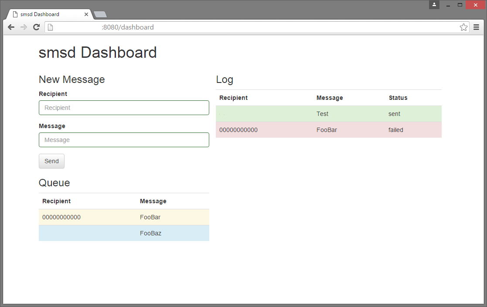

# smsd
REST API for sending SMS messages via locally attached GSM modem. Written in Node.js.

## Features  
 - No Gammu requirement/setup needed.
 - Optional dashboard for monitoring and sending messages.
 - Bunyan logging support.
 - Timerless modem control. Messages are sent when modem is ready.
 - User configurable input queue for buffering bursts of messages.
 - Signal status. Confirm signal strength when machine is in data centre.
 - Message log.



## Routes
**POST /api/sms**  
Add message to server queue. Data should be a JSON object in the form:  
```json
{
    "recipient": "01234567891",
    "message": "foobar"
}
```

Returns status code 'ok' on success or an error if message fails input validation. Queued messages will be assigned a UUID that can be used to check the progress of a message in the queues and logs.

**GET /api/modem/signal**  
Returns result of a CSQ query on the connected modem.
```json
{
  "code": "ok",
  "signal": {
    "rssi": 12,
    "ber": 0,
    "status": "good"
  }
}
```

**GET /api/sms/log**  
Returns an array containing the last 20 messages along with their final status.
```json
{
  "code": "ok",
  "log": [
    {
      "recipient": "01234567891",
      "message": "foobar",
      "id": "0ba3c3c5-b8a2-4be2-a8ad-2b2435b12f57",
      "retries": 3,
      "status": "sent",
      "timestamp": "2016-07-22T20:09:05.694Z"
    }
  ]
}
```

**GET /api/sms/queue**  
Returns an array containing the current queue of messages awaiting delivery.
```json
{
  "code": "ok",
  "queue": [
    {
      "recipient": "01234567891",
      "message": "foobar",
      "id": "f541d6bb-7424-43b0-b306-44bb2ecaeaad",
      "retries": 3,
      "status": "pending",
      "timestamp": "2016-07-22T20:14:21.671Z"
    }
  ]
}
```
## Configuration  
Server and modem configuration is performed using a JSON encoded configuration file. This can be passed in at startup or via config.json in current working directory.

If drop_priv is true the server will attempt to drop privileges to the specified user id.

```json
{
    "modem": {
        "device": "/dev/tty.usbserial-142",
        "baudrate": 115200,
        "rtscts": true
    },
    "enable_dashboard": true,
    "port": 8080,
    "drop_priv": false,
    "user": "smsd",
    "max_queue": 100,
    "message_retries": 3,
    "log_size": 20,
    "wake_interval": 30
}
```
## Installation
Requires Node.js and NPM.  
```sh
git clone https://github.com/darylturner/smsd.git
cd smsd
npm install --no-optional
```
## Startup  
It's recommended to run the server under a service management system such as pm2 or supervisord.

Running manually.
```sh
$ node server.js config.json | bunyan
[2016-07-22T20:51:45.089Z]  INFO: smsd/15848 on macbook.turner.private: modem ready
[2016-07-22T20:51:45.096Z]  INFO: smsd/15848 on macbook.turner.private: server listening on 8080
```

## Example
```sh

curl -s -H "content-type: application/json" -X POST http://sms.gateway.local/api/sms -d '{
    "recipient": "01234567891",
    "message": "foobar"
}' | json
{
  "code": "ok",
  "message": "d54a7064-df22-4659-b4b4-963b4ebd7cdc"
}
```
